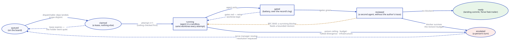

# The execution model

A task's life, and what each step writes down.



## Mint — the task joins a partition

`torve plan <spec>` turns one accepted, committed specification into task
contracts, deterministically: no model is called at any point. The contract
carries the scope it may touch, the decisions it inherits with the grades
they had at mint time, the acceptance commands, and the seat it runs on.

Minting onto a board is the manager's act. A contract the repository already
landed is minted *and* recorded as landed, from git's own trailer — a
repository carries every contract it ever executed, and a board that called
those queued would hand a worker somebody's finished work.

## Claim — one task, one worker, one lease

A task is dispatchable when this partition's board carries it as queued, its
dependencies have **landed** (a run that reached `ready` without landing
satisfies nothing — S-0019/A-3, S-0019/A-4), and nothing sharing its scope is in flight
(S-0019/A-6). Scope disjointness is conservative: what is provably shared
serializes, and an unconstrained allow-set clashes with everything, because
a task that may touch anything can prove itself disjoint from nothing.

The claim is a lease and nothing more. If the worker dies, the manager
notices the claim has gone quiet past its lease and releases it with the
reason recorded — activity means any recorded fact, never a heartbeat the
holder sends, because a wedged process can report itself healthy.

## Attempt — the agent in a sandbox

Each attempt gets a fresh container over the task's worktree. What the agent
receives is composed by the engine: the prompt, the role's skills written
from package data, the decisions it inherits, and — when a previous attempt
was reviewed — the feedback record.

What it does **not** receive is a credential. Under the broker the sandbox
holds no provider key and no store credential; it reaches models through one
loopback route per routed provider, with the key injected at the wire and
every response metered.

Two things an agent is expected to do from inside:

```bash
torve log divergence T-0142 --decision D-3 --grade LOCKED \
    --kind contradicted --class spec-gap \
    --claim "..." --evidence "path:line — what that line shows" --action halted

torve log owed T-0142 --touched src/app/session.py
```

The first records a divergence through the channel; the engine writes the
log file, so unparseable YAML and unstaged logs are not reachable states.
The second answers which LOCKED decisions the changed files touch with no
entry citing them — the same check the gate convicts on, asked while the
agent can still answer it. Silence over a governed file is the single most
common way an attempt is thrown away.

## Gates — the battery judges the diff

The battery runs in its own sandbox over the worktree, against the config
hash of the regime it ran under. Before it reads anything, the engine
rewrites the worktree's divergence log from the record, so what the gate
judges is what the store holds and not whatever the sandbox left behind.

A red battery does not end the run. The loop retries under the poison
ceiling and the task's own budgets, and a gate-red conviction can route the
next attempt to a different tier. What ends a run is the ceiling, a budget,
a halted divergence entry, a surviving review blocker, or an infrastructure
failure — each with its own escalation reason.

## Review — a second run over the candidate

With review configured, green gates mint a review task: a different agent,
isolated from the executor, judging the candidate diff without the author's
trace. Its findings gate the merge lane. A surviving blocker escalates the
target rather than landing it.

## Landing — the commit is the engine's

The runner composes the commit, not the agent: the author is the agent
identity, the trailers carry task, attempt, agent, config hash and the
decisions inherited, and the signing key never enters a sandbox. That
trailer is what makes a landing findable years later by anything that can
read git.

A landing is not a push. The commit lands on the task branch and the
candidate waits at `ready` for the serialized lane, which is `torve merge`
by default — a human act, and the recorded approval.

A manager pass can call that same lane as a leg, when `promotion.auto_merge`
arms it. The leg is a caller and not a policy: same `process_lane`, same CI,
approvals, review and quiet-window refusals, so nothing is gated twice and
no refusal changes because a pass asked instead of a person. It runs after
the relay and before the mint — a candidate that went green an hour ago is
owed its landing more than an unminted contract is owed its board row, and
landing first means the mint that follows reads a base that already moved.

A pause stops it. The relay runs during a pause because it delivers what is
already owed; landing advances the repository, and a pause says nobody has
capacity to look at what advancing produces.

## Escalation — the engine hands it to a person

Every ending that is not a landing is an escalation with a reason from a
closed vocabulary. The board shows it, the worktree is kept for triage, and
`torve manager resolve` is how a person hands the task back: requeued,
abandoned, or landed by hand. Only an operator may write that.

## What one dispatch records

For a task that took two attempts and landed:

```text
task.minted → task.claimed
  → attempt.started(1) → seat.consumed × n → attempt.finished(1) → gates.evaluated(1, red)
  → attempt.started(2) → seat.consumed × n → divergence.recorded × k
    → attempt.finished(2) → gates.evaluated(2, green)
  → landing.recorded
```

Each attempt carries the tier that actually ran it, its own gate verdict and
its own spend. That is the difference between "this dispatch took two tries"
and "here is what changed between them".
