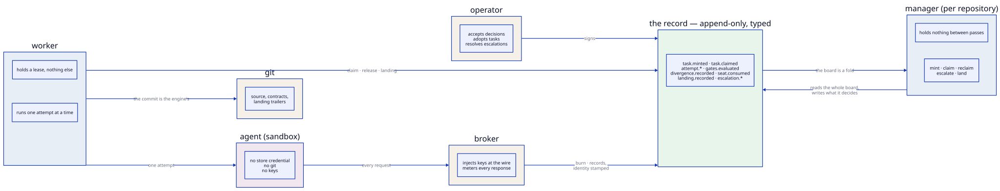

# System overview

Three things run: a **manager** that owns a repository's queue, **workers**
that execute one task at a time, and a **record** that both of them read and
write. Everything else — the board, the telemetry stream, the projections,
the tracker — is derived from the record.

## The actors

| Actor | Holds | Rule |
| --- | --- | --- |
| manager | nothing between passes | Rebuilds its whole view from the record on every pass. Mints, claims, reclaims expired leases, escalates. |
| worker | a lease, and nothing else | Claims one task, executes it, records the outcome, releases. A killed worker costs its lease and nothing more. |
| agent | a sandbox and a worktree | Runs inside a container with no store credential and no route to the record except the broker. |
| operator | the signature | Accepts decisions, adopts tasks, resolves escalations. These events have no other author. |

The separation is not decoration. A worker that remembered its assignment
would be a worker whose memory could disagree with the record, and a manager
that carried state between passes would be a manager whose restart is a
recovery procedure rather than a re-read.

## The layers (S-0015)

| Layer | Contents | Rule |
| --- | --- | --- |
| `base/` | shell, naming | imports nothing above it |
| `domain/` | task contracts, states, the event vocabulary and its authority table | pure; transitions are executed from facts, never by a model |
| `application/` | manager, worker, runner, review, planner, projections, the event log service | depends on ports only, never on adapters |
| `gates/` | the battery and its context builder | stands alone |
| `adapters/` | one directory per port: runtime, agent, event store, durable store, vcs, workspace, broker | independent of each other |
| `config/` | manifest, run configuration, the specification format | the format terminates at the planner (S-0007/D-17) |
| `cli/` | Typer verbs, Rich presentation, the composition root | presentation never crosses inward (S-0018/D-2) |

Five import-linter contracts enforce this mechanically and the `layering`
gate runs them on every attempt. It earns its keep: agents violate it
regularly and the gate catches it every time.

## One engine, two vintages

The manager is new. The machinery it drives — the attempt loop, the gate
battery, the review lane, the landing — is the original engine, kept as
libraries rather than rewritten (S-0044/D-12), because those parts were never
the problem. The whole of the seam between them is one module,
`application/executors.py`: it hands the runner a task and turns the run
back into the facts the record holds.

There used to be two dispatchers. The standing loop scanned the filesystem;
the manager folds the record. They shared the rules and differed only in
where the state they read came from, which was deliberate and temporary —
and the scan is now gone (S-0019 S-0019/A-8). What is left of it is the
adoption lock in `application/enginelock.py`, because a human adopting and
a manager pass minting a standing instance can still race for an id.

What still reads files rather than the record is the subject of
[what does not distribute](distribution.md).

## Where to start reading the code

| You want | Start at |
| --- | --- |
| what a fact looks like | `src/torve/domain/events.py` |
| how a fact is written | `src/torve/application/eventlog.py` |
| what the manager decides | `src/torve/application/manager.py` |
| what a worker does | `src/torve/application/worker.py` |
| how an attempt runs | `src/torve/application/runner.py` |
| what an agent may do | `src/torve/adapters/agent/harness.py` and `skills/` |
