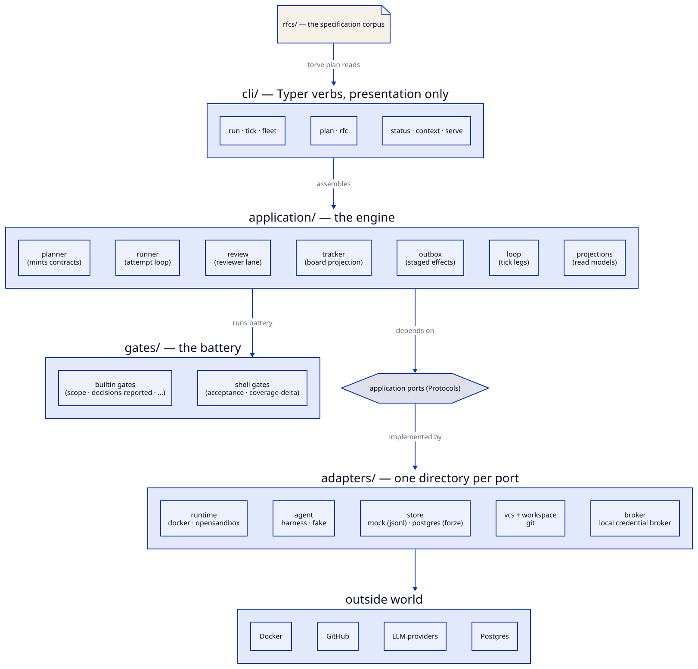

# System overview

Torve is a spec-and-gate engine: RFCs with graded decision tables are the
input, autonomous task execution under a gate battery is the machine, and
landing commits on `main` are the only output that counts. Everything else —
run states, telemetry, traces, the board — is derived record.

## The layers (RFC 0015)

| Layer | Contents | Rule |
| --- | --- | --- |
| `base/` | shell, naming | imports nothing above it |
| `domain/` | task contracts, states, attempt vocabulary | pure; transitions executed by the runner from facts, never by a model |
| `application/` | planner, runner, review, tracker, outbox, loop, projections | depends on ports only, never on adapters |
| `gates/` | the battery and its context builder | stands alone |
| `adapters/` | one directory per port: runtime, agent, store, vcs, workspace, broker | independent of each other |
| `config/` | manifest, runconfig, rfc format | the RFC format terminates at the planner (D-7.17) |
| `cli/` | Typer verbs, Rich presentation | presentation never crosses inward (D-18.2) |

Five import-linter contracts enforce this mechanically; the `layering` gate
runs them on every attempt. This part of the architecture is settled and
earning its keep — agents violate it regularly and the gate catches it.

## Who does what

- **The planner** (`torve plan`) mints task contracts from an accepted RFC's
  phasing — deterministically, with inherited decision grades and declared
  scopes. Humans accept RFCs; the machine derives the work.
- **The runner** (`torve run`) drives one task: agent in a sandbox, gate
  battery, reviewer lane, landing. See [execution](execution.md).
- **The tick** (`torve tick`) is the standing loop's single step: poll,
  recover, dispatch, merge, standing legs — then *exit*. There is no daemon
  (D-19.1, LOCKED). Scheduling ticks is the operator's (or cron's) job.
- **The tracker** projects engine state onto a GitHub board through the
  [outbox](tracker-outbox.md).
- **Gates** decide consequences; models only produce facts. Configuration —
  never the model — decides what a red gate or a review blocker does (D-2).

## What is deliberately absent

- No resident process of any kind (D-19.1, D-42.6).
- No agent-to-agent communication (D-31).
- No engine reads of agent-authored content for control flow — routing keys
  on gate outcomes only (D-37.1, D-34.5).
