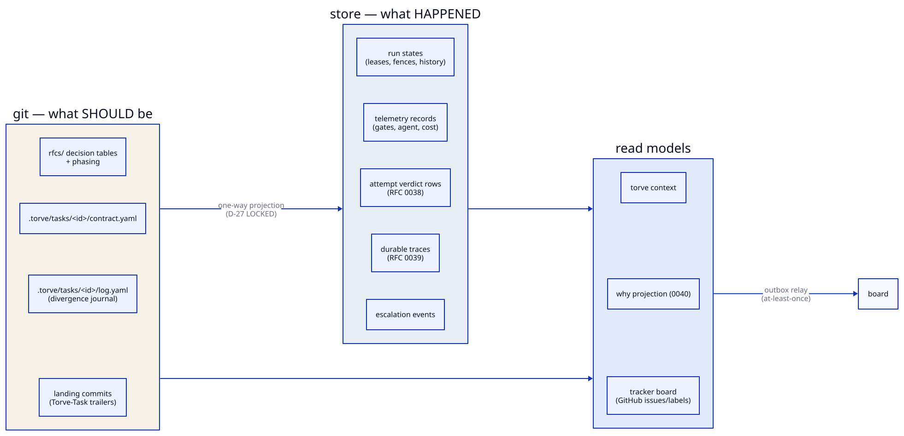

# State and truth

Two questions, two answers, and the second one changed.

**What should be?** The repository. Specifications with graded decision
tables, task contracts, source code. A human writes it, a human reviews it,
and nothing an agent does becomes intent without passing through a commit
somebody signed off.

**What happened?** [The record](record.md). Attempts, verdicts, landings,
escalations, divergences, spend. It used to be a durable store holding run
rows beside a git history holding trailers, with each answering part of the
question and neither answering it whole.

## The carriers

Several files still hold execution state. They are not competing answers —
each is a projection of the record with a reason to exist:

| Carrier | Holds | Why it exists |
| --- | --- | --- |
| the event log | every fact, append-only | the record itself |
| `.torve/telemetry.jsonl` | one row per attempt | what the cost, regime and quality projections read; **rendered from the event payload**, so it cannot disagree |
| `.wt/<task>.state.json` | the run the attempt loop is driving | the loop's own aggregate, and the only carrier a run without a store has |
| `.torve/tasks/<id>/contract.yaml` | what a task was asked to do | the authored artefact a human reviews and commits — and the *importer* the mint reads, not something dispatch consults |
| `.torve/tasks/<id>/log.yaml` | the task's divergences | written into the worktree from the record before each gate pass, and landed with the work so the diff carries its own account |
| landing commits | `Torve-Task` trailers | git's own record of completion — the one thing that survives a fresh clone with no store at all |

The rule that keeps them honest: **one record, rendered into carriers**.
Where two carriers hold the same fact, one of them is generated from the
other, and a test says so.

## What outranks what

- **A landing outranks everything.** A dependency is satisfied by a landing
  and by nothing else (A-29, A-31). A run that reached `ready` without
  landing has told the board nothing it can act on, and a fresh clone with
  no store still knows what landed because git does.
- **The board outranks the host.** Once a task is on the board, its state is
  the record's. The host's own run record decides only whether a contract is
  *minted* — a contract that ran and never landed stays off the board, since
  there is nothing true to record about it. After that, a person who
  requeues an escalation has said the thing that matters, and a file on one
  machine is not entitled to overrule it.
- **The contract outranks the corpus, at mint time.** A task inherits its
  decisions with the grades they had when it was minted. The corpus moving
  under a running task changes nothing about what that task was asked to do.
- **The minted contract outranks the file, once minted.** The mint records
  the contract, and that recorded copy is what dispatch reads and what the
  run is judged against. An edit to the file is not in force until the next
  pass re-mints it — which it does, recording the change, and never while
  the task is in flight. Before this, an edit between the mint and the
  dispatch took effect with nothing written down: the board said one thing
  and the gates enforced another.

## What is not in the record yet

The projections that answer planning questions — `torve context`, the why
report, the specification-quality readings — still read files. Every one of them is a join against tasks, and until the mint
carried the contract there was nothing to join to; now there is, and what
remains is the rewriting rather than the design. They are named as later
work in RFC 0044 §12, and they are the reason
[what does not distribute](distribution.md) is still worth reading.
