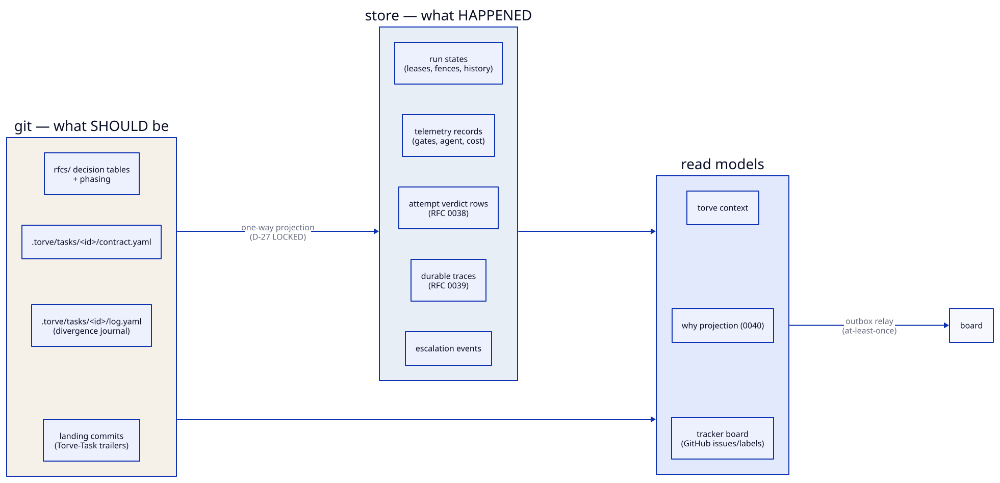

# State and truth

Two questions, two answers, and the second one changed.

**What should be?** The repository. Specifications with graded decision
tables, task contracts, source code. A human writes it, a human reviews it,
and nothing an agent does becomes intent without passing through a commit
somebody signed off.

**What happened?** [The record](record.md), and the few other carriers the
table below names — git for what landed, the forge for a pull request and a
battery's verdict, a contract for a review round. It used to be a durable
store holding run rows beside a git history holding trailers, with each
answering part of the question and neither answering it whole; now each fact
has exactly one place, written by the act that made it true.

## The carriers

Every fact the engine decides from has exactly one carrier, and a carrier
is the place the act that makes the fact true already writes it. No fact has
two, so nothing reconciles them and no two of them can disagree:

| Fact | Carrier | Written by | Read by |
| --- | --- | --- | --- |
| A task landed | its landing file, in the base tree or the document branch's remote tip | the landing commit | `landed()` |
| Which tasks a document carries, in order | the landing files on the document branch | the lane's landing | the pull request body, the battery, the wave |
| A pull request's state | the forge | a person or the lane | the lane, once per pass at most |
| A completion battery's verdict | a commit status `torve/completion` on the judged tip | the lane | the draft flag, the battery round |
| A review round's document, target, findings and phases | `round:` in its own contract, carried by `task.minted` | the review leg | the wave, the requeue's rescope, the morning report |
| Escalations, resolutions, attempts, gates, seat consumption | the record | manager, worker, operator | the board |

`.torve/telemetry.jsonl` is not on this table. It is a diagnostic stream —
one row per attempt, and the engine-health rows — that the ledger, the evals
and the night report read and no decision does (S-0099/D-6, S-0099/D-10). A
file a decision read would be a decision that depends on one host's disk,
which is what these carriers replaced.

The record is one carrier among several, not the sink of all of them: what
git, the forge or a contract holds it does not hold, and what it does hold
it holds once. The authored artefacts stay where a human puts them — a
task's contract and its divergence log are files in the repository, reviewed
and committed, not projections. The run a single process drives keeps its
own aggregate in `.wt/<task>.state.json`, the loop's memory and the only
carrier a run with no store has; but the board's answer to what happened is
the record's, never that file's.

## What outranks what

- **A landing outranks everything.** A dependency is satisfied by a landing
  and by nothing else (S-0019/A-3, S-0019/A-4). A run that reached `ready` without
  landing has told the board nothing it can act on, and a fresh clone with
  no store still knows what landed because git does.
- **The board outranks the host.** Once a task is on the board, its state is
  the record's. The host's own run record decides only whether a contract is
  *minted* — a contract that ran and never landed stays off the board, since
  there is nothing true to record about it. After that, a person who
  requeues an escalation has said the thing that matters, and a file on one
  machine is not entitled to overrule it.
- **The contract outranks the corpus, at mint time.** A task inherits its
  decisions with the grades they had when it was minted. The corpus moving
  under a running task changes nothing about what that task was asked to do.
- **The minted contract outranks the file, once minted.** The mint records
  the contract, and that recorded copy is what dispatch reads and what the
  run is judged against. An edit to the file is not in force until the next
  pass re-mints it — which it does, recording the change, and never while
  the task is in flight. Before this, an edit between the mint and the
  dispatch took effect with nothing written down: the board said one thing
  and the gates enforced another.

## What still reads files, and why

The planning projections read the record now. `torve why`, `torve status`
and `torve context` each take `--partition` (and `--dsn`), and naming a
partition is what selects the record; naming none reads this repository's
own files. One rule is automatic and it runs in the safe direction: a record
that turns out not to hold the run falls back to the files, never the
reverse. A v1 run left a state file and no log, so an empty record means
*ask the files*, not *nothing ever ran*.

Three things still read files whatever you name, and each for its own
reason:

| Reader | Why it is still on files |
| --- | --- |
| the findings ledger | it reports each finding's severity **and its claim**, and the record carries a claim only for a blocker (`blocker.raised`). Moving it would silently drop the text an operator triages by |
| operator feedback | there is no event kind for it. Human minutes and rework are a `torve feedback` file and nothing else |
| the corpus | the corpus *is* files. The decision graph is imported into the record; the documents stay where a human edits them |

The report says which carrier answered. `torve context` prints a
`read from —` line above the first count, and the JSON envelope carries a
`sources` block naming the carrier per block. That line exists because the
numbers are correct about whichever carrier produced them and say nothing
about the other: on this repository the record holds 10 attempt rows where
the files hold 636, and `$10.62` of spend against `$242.87`. Both are true.
Only one of them answers "what has this repository cost".
