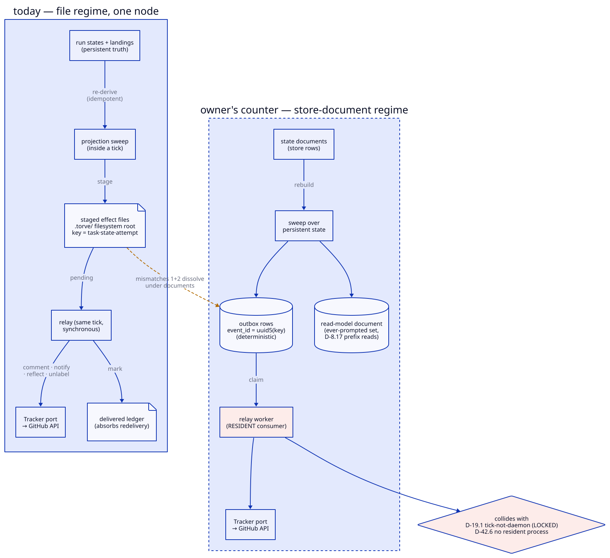

# The tracker outbox — the contested design

!!! info "A record, not documentation — 2026-09-03"

    The contest this page sets out is over. Derive-don't-record (S-0008/D-2) was
    retired by S-0044/D-3: facts are recorded when they become true, and rebuild
    is replay. The page is kept as the argument that produced that decision,
    including the counters that turned out to be right.

    The tracker itself is **deleted**, not pending. The whole projection —
    2,600 lines, both directions — was removed in September 2026 (S-0008
    S-0008/A-5) after being inert in every repository torve runs. Its design
    survives in S-0008 for whoever rebuilds it; what left with it is
    named in S-0020/A-1, and includes intake by issue, the `/torve` commands and
    the escalation paging S-0006 S-0006/D-11 still asks for.

The tracker projects engine state onto GitHub (issue comments, labels,
notifications). Effects must survive a crash between "decided to comment"
and "commented", and must not double-post on replay. That is the whole
problem the outbox solves.

## The design that emerged (S-0008/D-2)

- **Derive, don't record.** Effects are not captured at write time; a
  projection sweep re-derives them from run states and landings, staging
  idempotently under structured keys (`task_id · state · attempt`). A lost
  outbox is rebuilt from state, never invented.
- **File regime.** Staged effects are files under a filesystem root;
  `staged_keys()` enumerates them, and the S-0008/D-17 clear rules are prefix
  tests over that set ("was this task ever prompted").
- **In-tick relay.** The same tick that stages also relays: direct,
  synchronous calls on the Tracker port, with at-least-once carried by
  deliver-then-mark-ledger. Failure stays pending and retries next tick,
  forever; a refused reflection is a logged divergence.

This is small (~180 lines plus the tracker sweep), crash-correct on one
node, and its simplicity comes precisely from the rebuild-from-state
property.

## The S-0042/D-5 investigation (T-0246)

The question was whether `forze_kits.integrations.outbox` displaces this.
Verdict: **no fit** — four mismatches, of which the load-bearing three:
forze stages at write time from domain events (outbox table is the truth,
not re-derivable), keys on opaque UUIDs with a claim/mark-only query port
(no prefix reads), and relays to broker transports for a resident consumer.
Full evidence: `.torve/tasks/T-0246/log.yaml`.

## The owner's counters (2026-09-04)

> 1. State can be a document, not pure outbox — then outbox reconstruction
>    is a sweep over persistent state.
> 2. The key-prefix read is solved similarly by a document.
> 3. The synchronous in-tick relay doesn't fit a distributed system.

Taken together these are a coherent **store-document regime**, and they
change the verdict's weight distribution:

- **Counters 1+2 dissolve mismatches 1+2.** If run/tracker state lives in
  store documents, the sweep re-derives *into* a store-backed outbox with
  deterministic `event_id = uuid5(key)` — staging stays idempotent and
  rebuildable (the property S-0008/D-2 exists for), and an "ever-prompted"
  read-model document serves the S-0008/D-17 prefix reads that forze's query
  port cannot. The T-0246 log itself found the `uuid5` half of this bridge
  and refused it only because the relay half stayed unmapped.
- **Counter 3 is the actual disagreement — and it is not about the
  outbox.** The in-tick synchronous relay is a *single-node assumption*,
  chosen because S-0019/D-1 (tick-not-daemon, LOCKED) and S-0042/D-6 (no resident
  process) forbid the consumer that a distributed relay needs. forze's
  relay-with-consumer is the standard distributed shape; torve refused it
  to honor the residency doctrine, not because the shape is wrong.

**So the honest restatement of S-0042/D-5 is:** the no-fit verdict is correct
*conditional on the residency doctrine*. Under a store-document regime with
a resident relay worker, forze's outbox fits — mismatch 4 (the file-regime
test suite as acceptance bar) is then just a test-migration cost, not an
architectural argument.

## What each path costs

| | Keep S-0008/D-2 (file regime) | Store-document + forze outbox |
| --- | --- | --- |
| Crash safety | proven, one node | standard, any node |
| Moving parts | none beyond the tick | outbox table, read-model doc, relay worker |
| Residency | none (S-0019/D-1 intact) | resident consumer **required** |
| Multi-node | **no** — filesystem root, in-tick relay | yes |
| Failure policy | retry forever, divergence-log refusals | backoff → parked `failed`, operator requeue |
| Who owns delivery | the tick | the worker |

The failure-policy row hides a real semantic change: forze's default parks a
row as `failed` after max attempts — a GitHub outage would dead-letter the
board and add an operator step that S-0008/D-2's contract deliberately does not
have.

## The decision this actually is

Whether to adopt forze's outbox is downstream of one question: **does
tick-not-daemon survive distribution?** If the manager/connector direction
(forze durable runner, chartered) brings resident workers anyway, the relay
worker is one more, and the store-document regime is the natural shape. If
S-0019/D-1 stays LOCKED as charter, S-0008/D-2 stays — and distribution of the
*tracker* specifically is off the table while everything else distributes.

That question is taken up in [The fault line](../architecture/distribution.md).
